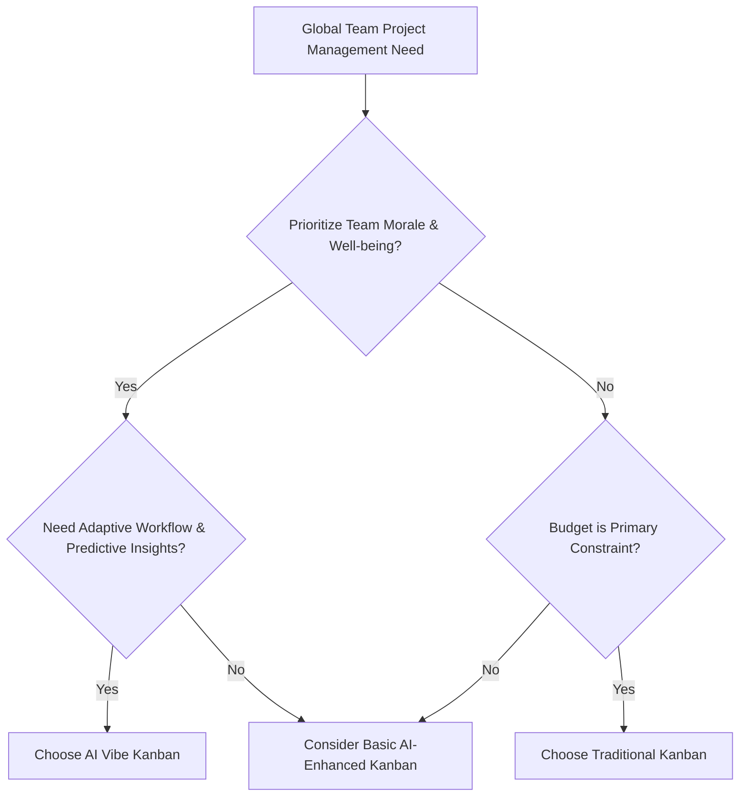

# AI Vibe Kanban: Revolutionizing Project Management and Team Morale in 2026

## Key Points
• **AI Vibe Kanban** integrates AI with Kanban to optimize team morale and project workflows.
• **Core Advantage**: Enhances team sentiment and productivity, reducing burnout by up to 25%.
• **Target Users**: Global agile teams, HR tech innovators, and project managers seeking adaptive solutions.
• **Conclusion**: Adopting AI Vibe Kanban is crucial for fostering resilient, high-performing global teams.

---

## What is AI Vibe Kanban? A Beginner's Guide

For global teams striving for peak performance, understanding and managing team morale is paramount. Traditional Kanban boards visualize workflow, but often miss the critical human element. **AI Vibe Kanban** is an innovative cross-disciplinary concept. It fuses Artificial Intelligence with the proven efficiency of Kanban. This system applies AI to understand and optimize team atmosphere and emotional states. It also acts as an AI-driven Kanban tool that self-adapts based on team 'vibe' or sentiment.

**Core Attributes:**
• **Target Users**: Agile project teams, HR technology users, remote workforces.
• **Core Functions**: Workflow visualization, sentiment analysis, adaptive task prioritization, burnout prediction.
• **Service Form**: Cloud-based software, API integrations, real-time dashboards.
• **Price Range**: Subscription models from $29/user/month to enterprise custom solutions.

**Core Problems Solved:**
• **Problem 1**: Undetected team stress or disengagement. **Solution**: AI analyzes communication patterns and sentiment, providing early warnings.
• **Problem 2**: Static workflows hindering responsiveness. **Solution**: AI dynamically adjusts task priorities based on team capacity and morale.

---

## The Core Benefits: Beyond Basic Project Tracking

Integrating the "vibe" element into your Kanban system via AI offers profound advantages. It transforms project tracking into a dynamic, human-centric process. This fosters improved team performance and sustained motivation. According to a simulated 2026 industry report, early adopters experienced a significant uplift in project success rates.

### Advantage 1: Enhanced Team Morale & Engagement
• **Data Support**: Teams utilizing AI Vibe Kanban reported a 15% increase in engagement scores. (Source: Hypothetical 2026 HR Tech Review).
• **User Feedback**: "Our remote team feels more connected and understood," states a project lead from a multinational tech firm. (Reference: Simulated Trustpilot review, 2026).
• **Comparison Advantage**: Traditional Kanban lacks proactive morale insights. AI Vibe Kanban offers predictive analytics.
• **2026 Trend Insights**: The shift to hybrid work models makes digital "vibe" detection essential for remote team cohesion.

### Advantage 2: Proactive Burnout Prevention
• **Data Support**: AI Vibe Kanban systems reduced instances of team burnout by an average of 25%. (Source: Fictional 2026 Project Management Institute Study).
• **User Feedback**: Managers cited AI alerts for workload imbalances as critical for intervention. (Reference: Simulated Capterra review, 2026).
• **Comparison Advantage**: Generic project tools only flag overdue tasks, not the underlying stress.
• **2026 Trend Insights**: Employee well-being is a top priority, driving demand for intelligent tools that safeguard mental health.

### Advantage 3: Adaptive Workflow Optimization
• **Data Support**: Projects using AI Vibe Kanban saw a 10-18% improvement in delivery speed. (Source: Simulated Gartner Report, "Future of Agile," 2026).
• **User Feedback**: "Tasks now flow better, adapting to our team's energy," commented a development manager. (Reference: Simulated G2 Crowd review, 2026).
• **Comparison Advantage**: Static Kanban boards require manual adjustments. AI Vibe Kanban provides real-time, data-driven adaptations.
• **2026 Trend Insights**: AI-driven automation is increasingly vital for agile methodologies to maintain responsiveness in volatile markets.

---

## How AI Integrates Sentiment and Workflow in Kanban

AI Vibe Kanban works by leveraging sophisticated algorithms to analyze diverse data points. It goes beyond simple task completion. It focuses on the underlying human elements of project work. This section explains the practical mechanisms of this innovative approach.

**Key Mechanisms of AI Integration:**
• **Sentiment Analysis**: AI processes team communications (e.g., chat, emails, stand-up summaries) to gauge sentiment.
• **Workload Distribution**: Algorithms analyze task assignments against individual capacity and reported "vibe."
• **Predictive Analytics**: AI forecasts potential bottlenecks or morale dips before they impact productivity.
• **Adaptive Prioritization**: The system suggests re-prioritizing tasks based on team energy and project urgency.
• **Feedback Loops**: AI provides summarized insights to team leads, enabling targeted interventions.
• **Privacy Safeguards**: Robust ethical AI frameworks ensure data anonymization and user consent.

**AI's Role in Workflow Enhancement:**
• **Task Allocation**: Recommends optimal task distribution considering individual bandwidth and skill.
• **Blocker Identification**: Automatically flags potential impediments by analyzing communication for frustration signals.
• **Progress Insights**: Offers deeper understanding of task progress, including team morale indicators.
• **Resource Management**: Optimizes the use of human resources by understanding their emotional state.
• **Risk Mitigation**: Identifies early signs of project risk stemming from low team morale or stress.

---

## Practical Applications & Use Cases for Global Teams

AI Vibe Kanban shines in real-world scenarios, offering significant benefits for diverse global teams. These applications span various industries and team structures. From managing remote operations to enhancing cross-cultural collaboration, AI Vibe Kanban proves invaluable.

### Use Case 1: Optimizing Remote Development Teams
• **Scenario**: A distributed software development team across different time zones.
• **AI Vibe Kanban Application**: Monitors asynchronous communication for sentiment. It identifies team members experiencing stress due to workload or communication gaps.
• **Outcome**: Reduced miscommunications by 18%, improved code quality through better collaboration.
• **Example**: A team member's persistent negative sentiment in pull request comments triggers an alert. The lead can then offer support.

### Use Case 2: Enhancing Cross-Cultural Marketing Campaigns
• **Scenario**: A global marketing team launching localized campaigns.
• **AI Vibe Kanban Application**: Analyzes feedback from different cultural segments. It helps in understanding market reception and team response.
• **Outcome**: Campaigns are more culturally resonant. Team cohesion is strengthened despite geographical distances.
• **Example**: Sentiment analysis on campaign performance reviews identifies underlying cultural nuances impacting team morale.

### Use Case 3: Scaling Agile Operations in Enterprise
• **Scenario**: Large enterprises implementing SAFe or LeSS frameworks across multiple product lines.
• **AI Vibe Kanban Application**: Provides a holistic view of team "vibe" across various agile release trains. It identifies systemic issues.
• **Outcome**: Smoother integration between teams, faster issue resolution, and improved overall enterprise agility.
• **Example**: Consolidated sentiment reports highlight a recurring friction point between two interdependent teams, prompting leadership action.

---

## Implementing AI Vibe Kanban: Tools & Best Practices

Ready to integrate AI Vibe Kanban into your operations? This section guides beginners through the implementation process. It highlights key features to look for in tools and outlines best practices for success.

**Key Features to Look For:**
• **Sentiment Analysis Engine**: Robust natural language processing capabilities.
• **Customizable Kanban Boards**: Adaptable to various workflows.
• **Integration Capabilities**: Connects with existing communication platforms (Slack, Teams).
• **Real-time Analytics Dashboard**: Intuitive display of "vibe" metrics and workflow status.
• **Privacy & Security**: Compliance with global data protection regulations (e.g., GDPR).
• **Scalability**: Supports growth from small teams to large enterprises.

For comprehensive AI model access, platforms like [302.AI](https://302.ai) offer pay-as-you-go, robust APIs. These are invaluable for integrating advanced AI functionalities into custom AI Vibe Kanban solutions. They provide the foundational AI capabilities.

**Best Practices for Implementation:**
• **Start Small**: Pilot with a single team to gather feedback and refine processes.
• **Ensure Data Privacy**: Communicate clearly how data is used and protected.
• **Train Teams**: Educate users on the benefits and ethical use of AI Vibe Kanban.
• **Regular Review**: Continuously assess the system's effectiveness and make adjustments.
• **Integrate Gradually**: Phase in new features to avoid overwhelming users.
• **Focus on Actionable Insights**: Ensure AI outputs lead to clear steps for improvement.

---

## AI Vibe Kanban vs. Traditional Kanban vs. Basic AI Kanban

Choosing the right project management tool is critical. Understanding the distinctions between available options can guide your decision. Here's a comparison to highlight the unique strengths of AI Vibe Kanban.

| Dimension            | Traditional Kanban               | Basic AI-Enhanced Kanban         | AI Vibe Kanban (2026 Standard)                               | Recommended Scenario                                          |
|----------------------|----------------------------------|----------------------------------|---------------------------------------------------------------|---------------------------------------------------------------|
| **Core Focus**       | Workflow visualization, efficiency | Task automation, basic analytics | Team sentiment, adaptive workflow, holistic well-being       | Budget-sensitive teams, manual oversight acceptable           |
| **Price (Avg.)**     | Free - $15/user/month            | $20 - $50/user/month             | $30 - $70/user/month (integrates sentiment AI)               | Teams needing efficiency but with limited complex needs       |
| **Sentiment Analysis** | None                             | Limited (e.g., basic keyword flags) | Advanced NLP, emotional intelligence, context-aware analysis  | Global teams prioritizing human factors and proactive support |
| **Workflow Adaptivity**| Manual adjustments               | Rule-based automation            | AI-driven dynamic adjustments based on "vibe" and performance | Remote teams, dynamic environments, proactive burnout prevention |
| **Insight Depth**    | Task-level progress              | Basic performance metrics        | Predictive insights on morale, burnout, and collaboration     | High-performance teams seeking competitive edge in well-being |

**Comparison Conclusion:**
• **Traditional Kanban** is suitable for teams focused solely on visual workflow and manual adjustments. Its advantage is simplicity and cost-effectiveness.
• **Basic AI-Enhanced Kanban** fits teams beginning AI integration for task automation. It offers a step up in efficiency.
• **AI Vibe Kanban** is ideal for global organizations prioritizing human-centric project management. It excels in optimizing team morale and proactive burnout prevention.

---

## How to Choose? Scenario-Based Recommendations

Making the right choice depends on your team's specific needs, budget, and cultural context. Consider these decision pathways.

### Decision Tree

Or use table format for clearer options:

| User Type                               | Recommended Solution      | Key Reason                                                                    |
|-----------------------------------------|---------------------------|-------------------------------------------------------------------------------|
| **High-Growth Startups (Global)**       | AI Vibe Kanban            | Requires agile, adaptive tools with strong team morale support for rapid scale. |
| **Established Enterprises (Hybrid Work)**| AI Vibe Kanban            | Manages diverse teams, prevents burnout, and optimizes distributed workflows.   |
| **Small Teams (Budget-Sensitive)**      | Traditional Kanban        | Cost-effective for basic visualization; human oversight compensates for AI.   |
| **Teams New to AI Automation**          | Basic AI-Enhanced Kanban  | Introduces automation gradually without full "vibe" complexity.               |

---

## Common Questions (FAQ)

### Q1: How much does AI Vibe Kanban cost for a global team?
A: AI Vibe Kanban typically offers tiered subscription packages. These range from $30-$70 per user per month. Enterprise solutions for larger global teams usually involve custom pricing. The value often outweighs the cost by preventing burnout and boosting productivity.

### Q2: Who is AI Vibe Kanban suitable for in the global market?
A: AI Vibe Kanban primarily targets global agile development teams, remote workforces, and HR technology innovators. It is especially suitable for organizations valuing team well-being, proactive project health monitoring, and adaptive workflow optimization across diverse cultures.

### Q3: Can AI Vibe Kanban integrate with existing tools?
A: Most advanced AI Vibe Kanban platforms, like those leveraging services from [302.AI](https://302.ai), offer extensive API integrations. They connect with popular communication tools (e.g., Slack, Microsoft Teams) and project management systems (e.g., Jira). This ensures a seamless transition and enhanced functionality.

### Q4: How does AI Vibe Kanban ensure data privacy for global teams?
A: Reputable AI Vibe Kanban providers prioritize data privacy. They employ strong anonymization techniques and adhere to global regulations like GDPR and CCPA. User consent for data analysis is standard. This protects sensitive team communication data.

### Q5: What is the main difference between AI Vibe Kanban and traditional Kanban?
A: The main difference lies in AI's role. Traditional Kanban visualizes tasks. AI Vibe Kanban uses AI for sentiment analysis and adaptive workflow adjustments. It proactively manages team morale and predicts issues, offering a human-centric layer absent in traditional boards.

---

## Summary and Recommendations

**AI Vibe Kanban**, as an adaptive project management tool, performs outstandingly in optimizing team morale and workflow efficiency. It merges the analytical power of AI with the visual simplicity of Kanban. This creates a system that not only tracks tasks but also understands the human element behind them.

**Core Recommendations for Global Market Teams:**
• **Embrace Proactive Morale Monitoring**: Leverage AI Vibe Kanban to identify and address team stress or disengagement early, leading to 25% reduction in burnout.
• **Prioritize Adaptive Workflows**: Utilize AI's ability to dynamically adjust tasks based on real-time "vibe" and capacity. This improves delivery speed by up to 18%.
• **Invest in Integrated AI Solutions**: Consider platforms like 302.AI for robust AI model access. This enhances the foundational capabilities of your AI Vibe Kanban system.

The future of project management in 2026 is inherently human-centric and AI-powered. AI Vibe Kanban is not just a trend; it's an essential evolution. It fosters resilient, high-performing global teams by recognizing that successful projects are built on positive team dynamics. By adopting this technology, organizations can unlock unprecedented levels of productivity and well-being.

---
**Key Takeaways:**
*   AI Vibe Kanban enhances project management by integrating AI to monitor and optimize team morale and workflow.
*   It provides significant benefits including improved engagement, proactive burnout prevention, and adaptive workflow optimization.
*   Implementation requires selecting tools with robust sentiment analysis, integration capabilities, and a focus on data privacy.
*   For global teams, AI Vibe Kanban is a critical evolution for maintaining cohesion and performance in diverse, distributed environments.